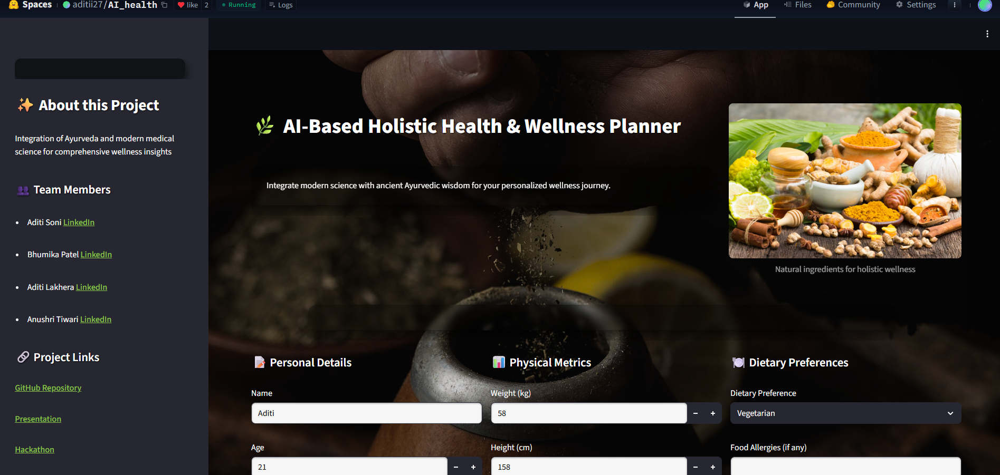
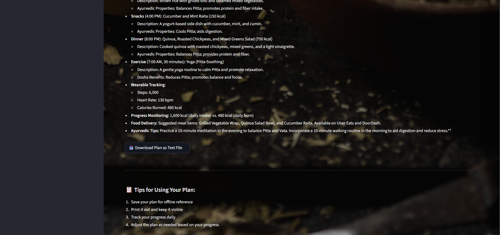
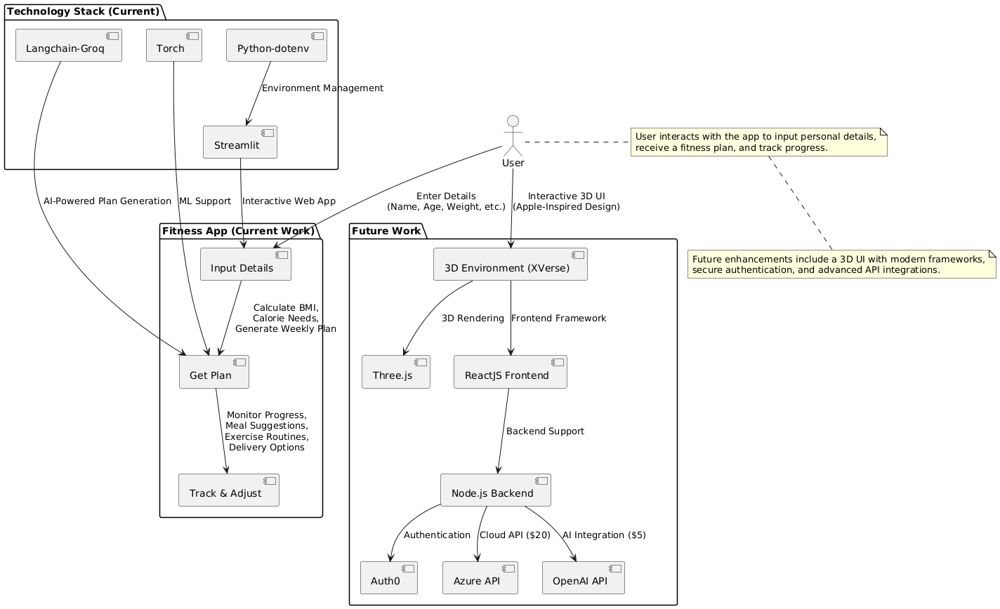

# 📈 AI-Health Advisor

A Hugging Face Space for personalized weekly diet and exercise planning, integrating modern medical science and Ayurveda for holistic wellness.

[Visit Project on Hugging Face](https://huggingface.co/spaces/aditii27/AI_health)

---

## 🚀 Features

- **Personalized Weekly Plans:** Custom diet and exercise routines based on your health metrics, goals, and preferences.
- **Dynamic Adjustments:** Plans adapt to your selected month and local cuisine.
- **Dietary Preferences & Allergies:** Vegetarian, Vegan, Keto, Halal, and custom allergy support.
- **Wearable Integration:** Track steps, heart rate, and calorie burn.
- **Progress Monitoring:** Daily calorie intake vs. burn and weight tracking.
- **Food Delivery Integration:** Meal suggestions and delivery options from platforms like Uber Eats and DoorDash.
- **Ayurvedic Insights:** (Planned) Dosha assessment, seasonal herbs, and modern validation.

---
## 🖼️ Screenshots

**Main Interface**  

**Plan Example**  

**Food Delivery Integration**  

**Future Implementation**  

---

## 🧩 Tech Stack

- **Frontend:** Streamlit
- **AI Model:** Langchain-Groq (Llama 3)
- **Backend:** Python
- **Integration:** dotenv for environment variables, torch for ML support

---

## 🛠️ Getting Started

1. **Clone the repository:**
git clone https://github.com/aditii27/AI_Health_v2.git
cd AI_Health_v2

text
2. **Install dependencies:**
pip install -r requirements.txt

text
3. **Set up environment variables:**  
Create a `.env` file with your API keys as needed.
4. **Run the app:**
streamlit run app.py

text

---

## 👩‍💻 Team

- [Aditi Soni](https://www.linkedin.com/in/aditi-soni-259813285/)
- [Bhumika Patel](https://www.linkedin.com/in/bhumika-patel-ml/)
- [Aditi Lakhera](https://www.linkedin.com/in/aditi-lakhera-b628802bb/)
- [Anushri Tiwari](https://www.linkedin.com/in/anushri-tiwari-916494300/)

---

## 📚 Project Links

- [GitHub Repository](https://github.com/aditii27/AI_Health_v2)
- [Presentation](https://github.com/aditii27/AI_Health_v2/blob/main/HackGirl_PPT_HackSRIT.pptx)
- [HackSRIT Hackathon](https://unstop.com/hackathons/hacksrit-shri-ram-group-of-institutions-jabalpur-1471613)

---

## 🌿 Future Integrations

- Enhanced Ayurvedic insights and dosha recommendations
- Seasonal herbs and spices (Ayurveda)
- Modern medical validation for traditional advice
- Combined holistic wellness tracking

---
